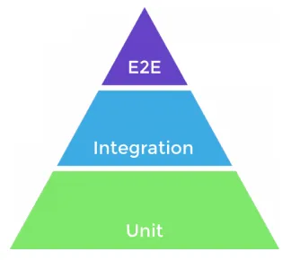

🕸️ **Fastify:** é um micro framework do NodeJS popular com uma API semelhante ao `express`, sendo mais atual, mais perfomática e mais atualizad que o `express`. 

- Extremamente performático.
- Integrado ao TypeScript
- Desenvolvimento amigável

## 💽 Banco de Dados

**SQLite:** é um banco de dados relacional, excelente para aprendizagem. Todos os dados são salvos em arquivos físicos, sem a necessidade de instalação de softwares. 

- As querys no banco de dados, são semelhantes aos outros banco de dados relacionais como MySql, PostgreSQL.
- Existem várias estratégias para a conexão com banco de dados
    - Drivers nativos (bibliotecas de baixo nível) → as query serão buscadas da maneira menos abstrada possível.
    - Query Builders (Construtor de Querys) → Não é necessário conhecimento profundo em banco de dados, o foco é mais na linguagem de desenvolvimento. Mistura código JavaScript com o banco de dados.
        
        ```jsx
        knex('users'.where({ // Isso aqui será convertido para um query na liguagem SQL
        	first_name: 'Test',
        	last_name: 'User'
        }).select('id')
        ```
        
    - ORM (Object Relational Mapper) → é uma técnica utilizada no desenvolvimento de software que permite mapear objetos em um sistema orientado a objetos para tabelas em um banco de dados.
    
    🤖 **Knex:** é um construtor de consultas para o banco de dados que ele se conecta. Fornece um conjunto de funcionalidades básicas para relizar qualquer tipo de operação no banco de dados.
    
    🦴 **Zod:** É uma biblioteca usada para a validação de qualquer tipo de dados, para validar criação de usuários, variáveis de ambientes e etc.
    
    🌐 **Insomnia:** É um fremework Open Source para desenvolvimento/teste de API Clientes. Com ele podemos fazer requisições Rest, SOAP, GraphQ e GRPC. Ao utilizar essa ferramenta, é possível fazer requisições para API’s.
    
    🍪 **Cookies:** Basicamente são formas de manter contexto entre requisições, são muito utilizados em redes sociais, é obrigado pela LGPD (Lei Geral de Proteção de Dados) que seja perguntado ao usuário se ele aceita salvar os cookies naquela aplicação. Esse “ID” salvo pelos cookies, é usada para conseguir validar se a mesma pessoa, baseada no ID que está salvo nos cookies, fez requisições e e etc.
    
    ## 🔬 Testes Automatizados
    
    **Testes Automatizados:** É uma maneira de controlar a execução de teste de software, a comparação com dos resultados esperados com os resultados reais. Nada mais é que automarizar um processo manual conduzido por humanos afim de revisar e validar determinado produto. Grande parte dos projetos que utilizam de desenvolvimentos ágeis e DevOps, incluem testes automatizados desde o ínicio.
    
    Existem diversos tipos de testes: 
    
    - **Unitários**: testam uma pequena unidade da aplicação,  uma pequena parte de forma isolada, como uma função por exemplo, esses testes unitários confirma se a entradada esperada para uma função corresponde à saída.
    - **Integração:** Uma unidade do código pode fazer uma chamada externa para um serviço de terceiros (Uma API por exemplo), e o código que está sendo testado não terá acesso ao código desta API por exemplo, então o testes de integração envolvem simular essas dependências de terceiros ou comunicação entre duas ou mais unidades e confirma que o código que tem interface com elas se comporta como esperado. São semelhantes aos testes unitários na forma como são escritos e em relação às ferramentas.
    - **Testes de Ponta a Ponta (E2E):** São testes que simulam uma experiência de nível de usuário, as ferramentas de E2E capturam e reproduzem ações do usuário, de modo que os planos de testes passam a ser gravações dos principais fluxos e experiência do usuário

    **Pirâmide de Testes:** é uma forma gráfica de demonstrar de maneira simples os tipos de testes, seus níves, velocidade de implementação e complexidade dos testes realizados. Isso pode ser feito para nos ajudar a chegar ao custo de implementação e a manutenção de cada nível de teste, além de nos fornecer informações de qual nível devemos testar primeiro.

    A divisão mais comum é representada por três níveis

    - Base: Testes de unidades
    - Meio: Testes de Integração
    - Topo: Testes de Ponta a Ponta (E2E, UI ou Testes de Interfaces)

    A ideia no final é que tenha poucos testes E2E, muitos testes de integração e mais ainda testes unitários 

    